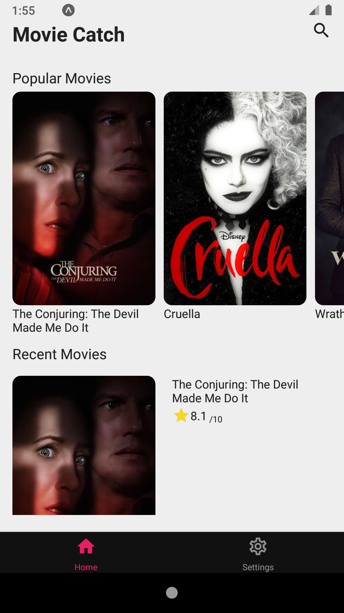
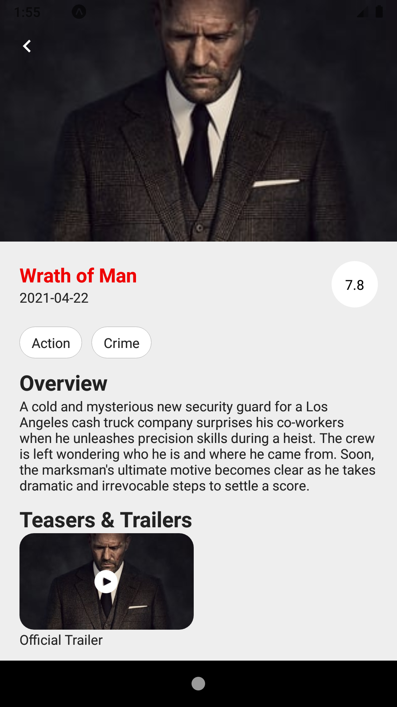
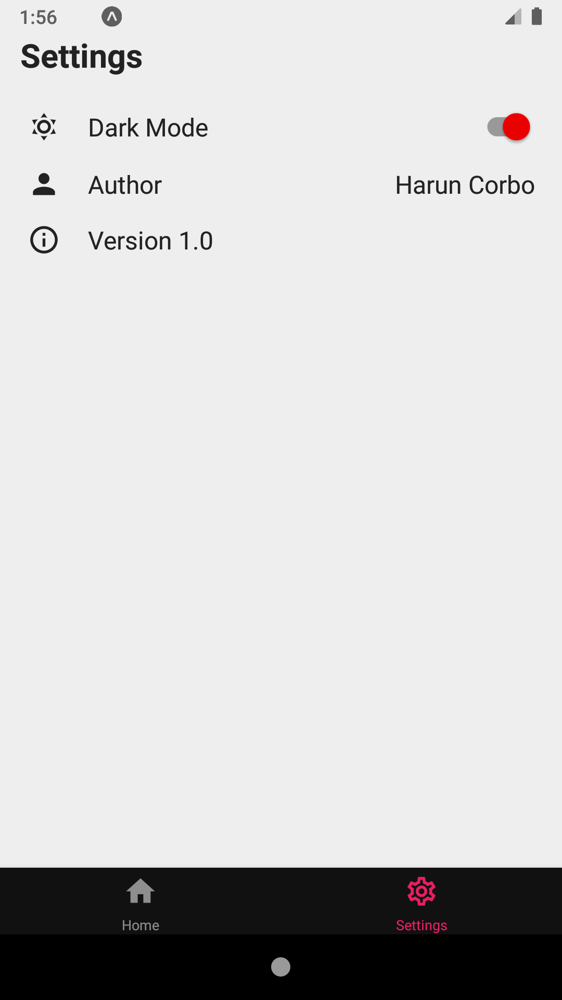
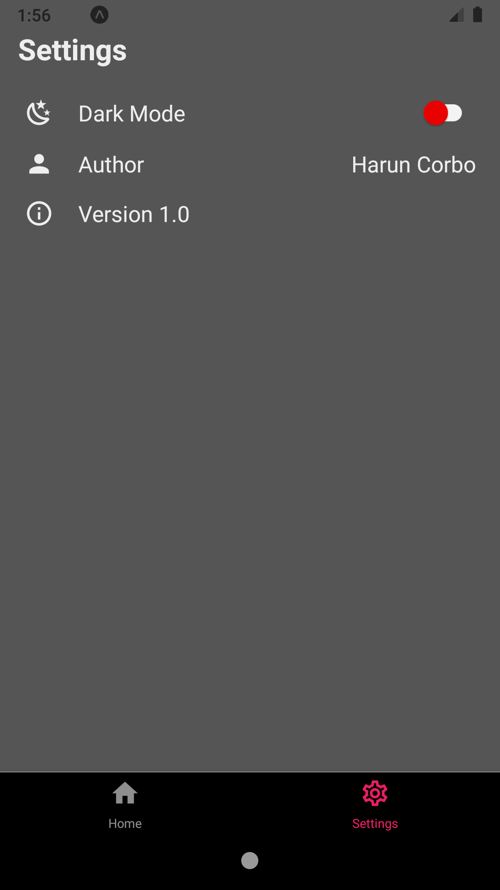
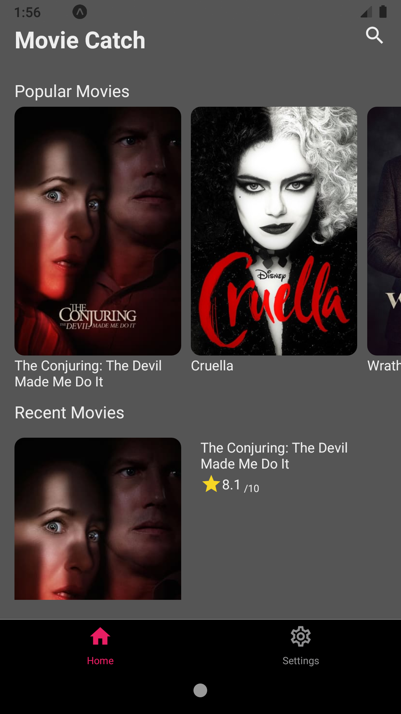

# movie_app_react_native
Movie app is your movie guide. The fastest and easiest way to find Movies on your device. Know about ratings and reviews from The Movie Database (TMDb).

## APIs
TMDb

## Screenshots

#### Home Screen

#### Movie Detail

#### Video

#### Settings Screen

#### Dark Mode

## Expo
This project has been built using Expo.
Go to expo project page:

https://expo.io/@hcorbo/mobile_movie_app

exp://exp.host/@hcorbo/mobile_movie_app

## Run Instructions
git clone "repo"
npm install
npm start
